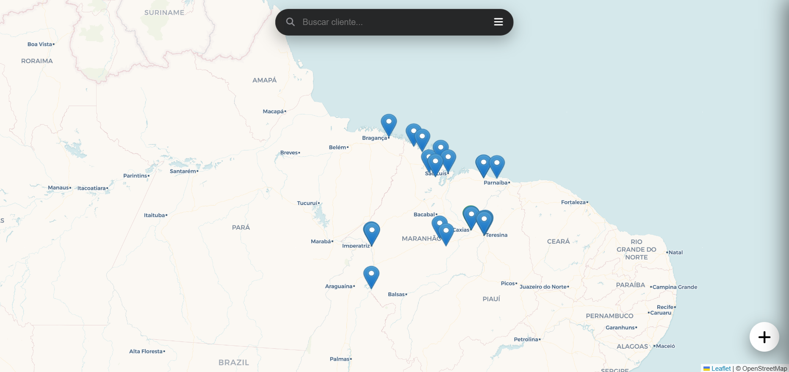
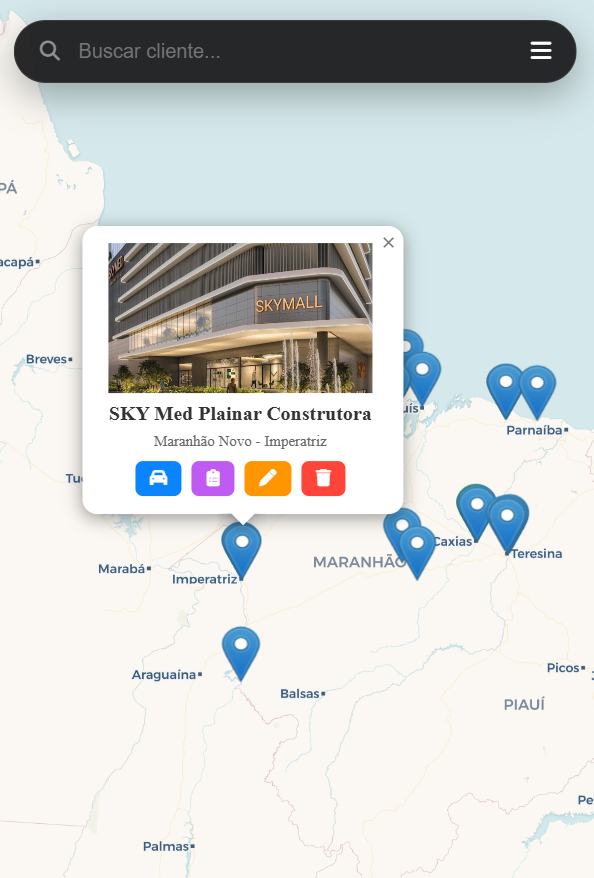

# 📱 Rota Vendas PWA

> Sistema de gestão de vendas e rotas georreferenciadas desenvolvido para otimizar o atendimento externo de representantes comerciais.


[](https://rota-vendas-app.web.app)

## 🎯 Sobre o Projeto
O **Rota Vendas** é uma aplicação **PWA (Progressive Web App)** desenvolvida para resolver o problema de logística e emissão de pedidos em campo. O app permite cadastrar clientes via GPS, traçar rotas visuais em um mapa interativo e gerar pedidos em PDF com assinatura digital na hora, eliminando o uso de papel.

## ✨ Features (Funcionalidades)

📍 **Geolocalização Inteligente**
Cadastro automático de clientes capturando a latitude/longitude exata via GPS do dispositivo.

🗺️ **Mapa Interativo (Light Mode)**
Visualização de rotas com pinos coloridos por status (🔵 Em aberto, 🟢 Concluído, 🔴 Sede), otimizado para performance.

📝 **Gestão de Pedidos**
Criação de pedidos com cálculo automático e interface otimizada para celular.

✍️ **Assinatura Digital**
Captura de assinatura do cliente e do vendedor diretamente na tela touch.

📄 **Geração de PDF**
Emissão instantânea de documentos em PDF prontos para compartilhamento via WhatsApp.

📱 **Modo PWA**
Instalável no Android/iOS, funcionando como um app nativo (ícone na home, tela cheia).

## 📱 Capturas de Tela

<div style="display: flex; flex-wrap: wrap; gap: 10px;">
  
  
  
</div>

## 🚀 Como Rodar o Projeto

### 🌐 Acesso Online (Recomendado)
Acesse a versão de produção hospedada no Firebase:
👉 **[https://rota-vendas-app.web.app](https://rota-vendas-app.web.app)**

### 💻 Rodar Localmente
1. Clone este repositório:
   ```bash
   git clone [https://github.com/SEU_USUARIO/rota-vendas.git](https://github.com/SEU_USUARIO/rota-vendas.git)
Abra o arquivo index.html diretamente no seu navegador.

Nota: Para funcionamento completo das APIs de geolocalização e PWA, recomenda-se usar um servidor local (como o "Live Server" do VS Code).

🛠 Tecnologias Utilizadas
Frontend: HTML5, CSS3 (Glassmorphism), JavaScript ES6+.

Mapas: Leaflet API + CartoDB Tiles.

Backend: Firebase (Firestore, Auth, Hosting).

Libs: html2pdf.js, Viewer.js, FontAwesome.

Desenvolvido por Gabriel Guarnieri 💻